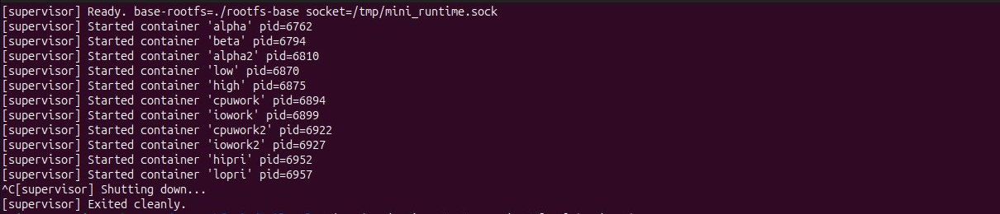
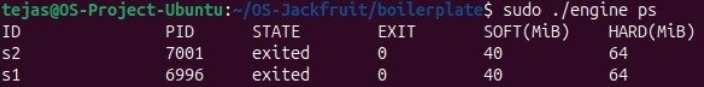
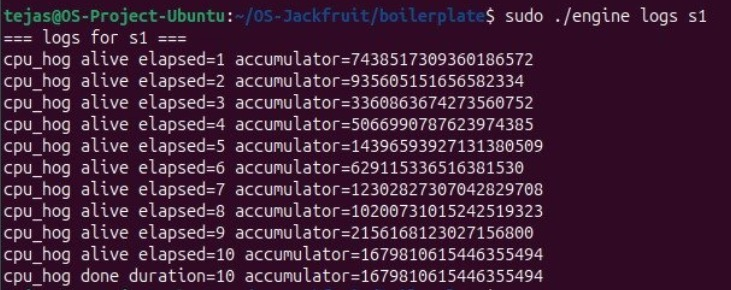
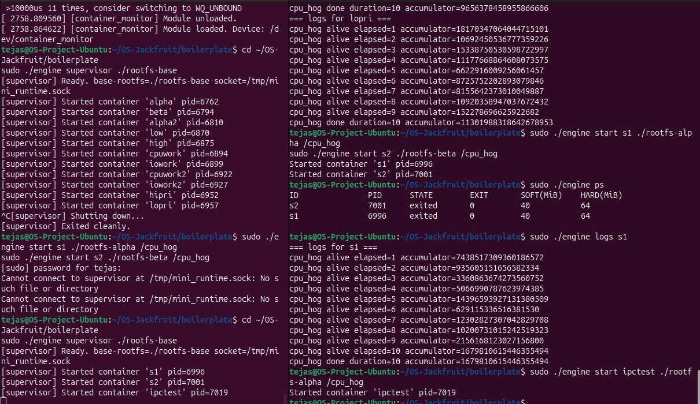
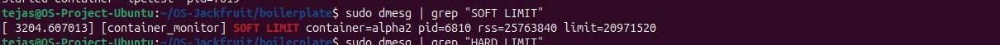
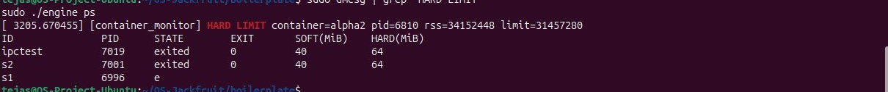
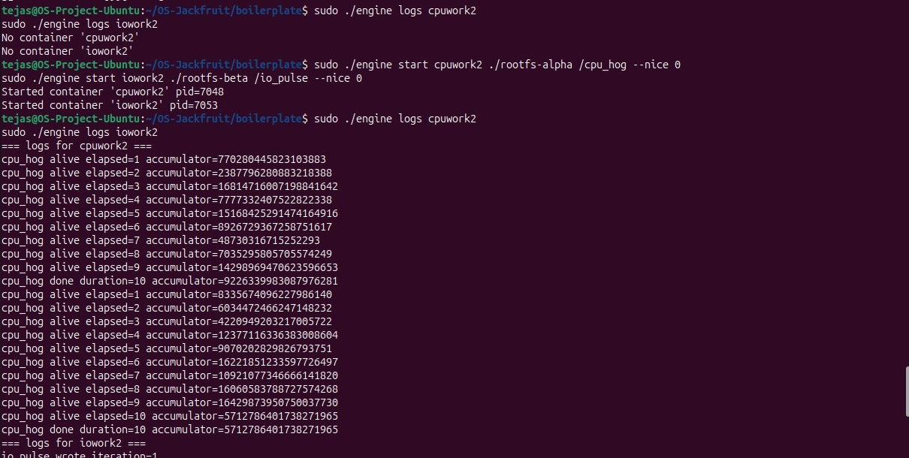
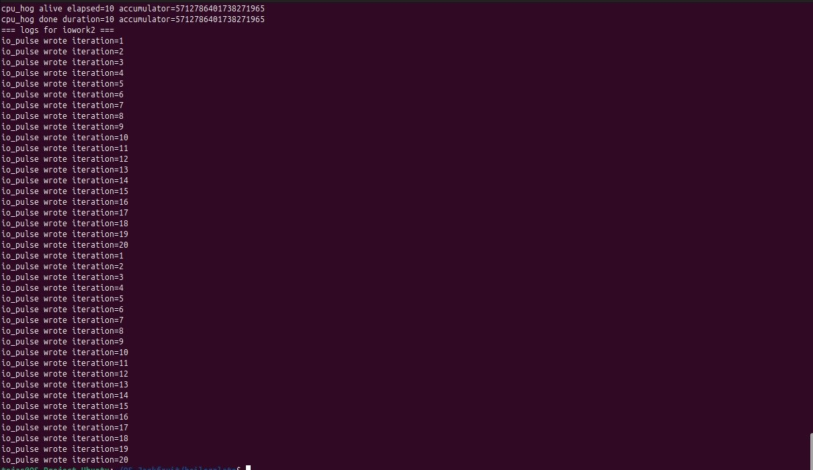
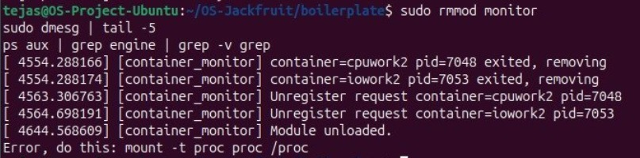

# Multi-Container Runtime

**Team Members:**
| Name | SRN |
|------|-----|
| Tejas Ponnappa | PES1UG24CS498 |
| Tejas P | PES1UG24CS497|

---

## Project Summary

A lightweight Linux container runtime in C with:
- A long-running **supervisor daemon** managing multiple isolated containers via `clone()` with PID/UTS/mount namespaces
- A **UNIX domain socket** control plane for CLI ↔ supervisor communication
- A **bounded-buffer logging pipeline** (producer/consumer threads) routing container stdout/stderr to per-container log files
- A **Linux Kernel Module** (`monitor.ko`) that tracks container RSS usage and enforces soft/hard memory limits via a periodic timer and `ioctl`

---

## Build, Load, and Run Instructions

### Prerequisites

Ubuntu 22.04 or 24.04 VM with Secure Boot OFF. 

```bash
sudo apt update
sudo apt install -y build-essential linux-headers-$(uname -r) git
```

### Clone and Build

```bash
git clone https://github.com/TejasPonnappa/OS-Jackfruit.git
cd OS-Jackfruit/boilerplate
make
```

This produces: `engine`, `cpu_hog`, `memory_hog`, `io_pulse`, `monitor.ko`

### Prepare Root Filesystems

```bash
mkdir rootfs-base
wget https://dl-cdn.alpinelinux.org/alpine/v3.20/releases/x86_64/alpine-minirootfs-3.20.3-x86_64.tar.gz
tar -xzf alpine-minirootfs-3.20.3-x86_64.tar.gz -C rootfs-base
cp -a ./rootfs-base ./rootfs-alpha
cp -a ./rootfs-base ./rootfs-beta
```

### Copy Workload Binaries into Rootfs

```bash
cp cpu_hog memory_hog io_pulse ./rootfs-alpha/
cp cpu_hog memory_hog io_pulse ./rootfs-beta/
```

### Load Kernel Module

```bash
sudo insmod monitor.ko
ls -l /dev/container_monitor
sudo dmesg | tail -3
```

### Start Supervisor

In a dedicated terminal:
```bash
sudo ./engine supervisor ./rootfs-base
```

### CLI Usage (in another terminal)

```bash
sudo ./engine start alpha ./rootfs-alpha /cpu_hog
sudo ./engine run alpha ./rootfs-alpha /cpu_hog
sudo ./engine ps
sudo ./engine logs alpha
sudo ./engine stop alpha
```

### Memory Limit Demo

```bash
sudo ./engine start memtest ./rootfs-alpha /memory_hog --soft-mib 20 --hard-mib 30
sudo ./engine ps
sudo dmesg | grep container_monitor | tail -5
```

### Scheduling Experiment

```bash
sudo ./engine start cpuwork ./rootfs-alpha /cpu_hog --nice 0
sudo ./engine start iowork  ./rootfs-beta  /io_pulse --nice 0

sudo ./engine start hipri ./rootfs-alpha /cpu_hog --nice -10
sudo ./engine start lopri ./rootfs-beta  /cpu_hog --nice 10
```

### Teardown

```bash
sudo ./engine stop alpha
sudo rmmod monitor
sudo dmesg | tail -3
```

---

## Demo Screenshots

### 1. Multi-Container Supervision


### 2. Metadata Tracking (`ps`)


### 3. Bounded-Buffer Logging


### 4. CLI and IPC


### 5. Soft-Limit Warning


### 6. Hard-Limit Enforcement


### 7. Scheduling Experiment



### 8. Clean Teardown


---

## Engineering Analysis

### 1. Isolation Mechanisms

Each container is created with Linux `clone()` using three namespace flags:

- **`CLONE_NEWPID`** — the container gets its own PID namespace. The first process inside appears as PID 1.
- **`CLONE_NEWUTS`** — the container gets its own hostname via `sethostname()`.
- **`CLONE_NEWNS`** — the container gets its own mount namespace. We call `chroot()` to restrict the filesystem view and `mount("proc", "/proc", "proc", ...)` gives the container a working `/proc`.

What the host kernel still shares: network namespace, cgroup namespace, and physical memory.

### 2. Supervisor and Process Lifecycle

A long-running supervisor is necessary because container processes are children of whatever process calls `clone()`. If the calling process exits, orphaned children are reparented to PID 1 making tracking and signaling impossible.

The supervisor:
1. Calls `clone()` to create each container child with new namespaces
2. Maintains a linked list of `container_record_t` structs tracking each container's PID, state, limits, and log path
3. Installs a `SIGCHLD` handler that calls `waitpid(-1, WNOHANG)` to reap exited children, preventing zombies
4. Updates container state atomically under a mutex

### 3. IPC, Threads, and Synchronization

**Path A — Logging (pipe):** Each container's stdout/stderr is connected to a pipe. The supervisor's pipe-reader thread pushes `log_item_t` chunks into the bounded buffer. The logging consumer thread pops chunks and writes them to per-container log files.

**Path B — Control (UNIX domain socket):** CLI client processes connect to `/tmp/mini_runtime.sock`, send a `control_request_t` struct, and receive a `control_response_t`. The supervisor's event loop uses `select()` to accept connections without busy-waiting.

**Bounded buffer synchronization:** Uses `pthread_mutex_t` with two `pthread_cond_t` variables (`not_empty`, `not_full`). A spinlock would be wrong here because both producer and consumer can block for long periods — a mutex with condition variables is correct.

### 4. Memory Management and Enforcement

**RSS (Resident Set Size)** measures physical RAM pages currently mapped. It does not measure swapped pages, unfaulted memory-mapped files, or shared library pages.

- The **soft limit** logs a `KERN_WARNING` once when RSS exceeds it but the process continues running.
- The **hard limit** sends `SIGKILL` to the container process when RSS exceeds it.

**Why kernel space?** A user-space monitor would read `/proc/<pid>/status` involving context switches and scheduling delays. The kernel module reads `get_mm_rss()` directly from the task's `mm_struct` with no syscall overhead.

### 5. Scheduling Behavior

**Experiment 1: CPU-bound vs I/O-bound (nice=0)**
`io_pulse` completed 20 I/O iterations while `cpu_hog` ran its 10-second loop. Linux CFS gives I/O-bound workloads lower `vruntime` because they voluntarily yield the CPU on each `write()` syscall, so they get scheduled immediately on wakeup.

**Experiment 2: High priority (nice -10) vs Low priority (nice +10)**
CFS uses nice values to set per-task weights — nice -10 gets approximately 4× the CPU weight of nice +10. On a single-core VM the high-priority container gets more time slices per scheduling period.

---

## Design Decisions and Tradeoffs

### Namespace Isolation
**Choice:** `chroot` instead of `pivot_root`. Simpler to implement but a privileged process can escape it. `pivot_root` fully replaces the root mount point and is escape-resistant. For a student project running trusted workloads, `chroot` is sufficient.

### Supervisor Architecture
**Choice:** Single-threaded event loop with `select()` + `SIGCHLD` handler. One client is handled at a time — a slow `run` command blocks other CLI clients. A thread-per-client design would allow concurrency but adds locking complexity.

### IPC / Logging
**Choice:** UNIX domain socket for control; pipes for logging. Pipes are the natural fit for streaming stdout/stderr — unidirectional, kernel-buffered, EOF-signaling. Sockets are the natural fit for request/response CLI interactions.

### Kernel Monitor
**Choice:** Mutex (not spinlock) to protect the monitored list. The timer callback runs in process context and `get_task_mm()` may sleep internally — a spinlock here would be incorrect.

### Scheduling Experiments
**Choice:** `nice()` values instead of cgroup CPU quotas. Nice values are directly observable in scheduling behavior and require no additional kernel configuration.

---

## Scheduler Experiment Results

### Experiment 1: CPU-bound vs I/O-bound

| Container | Workload  | Duration | Output |
|-----------|-----------|----------|--------|
| cpuwork2  | cpu_hog   | 10s      | 9 progress lines + done |
| iowork2   | io_pulse  | ~10s     | 20 write iterations |

`io_pulse` completed more iterations because it voluntarily sleeps between I/O operations, freeing the CPU. When it wakes its CFS `vruntime` is lower than `cpu_hog`'s so it is immediately scheduled.

### Experiment 2: High vs Low Nice Value

| Container | Nice | Duration | Observation |
|-----------|------|----------|-------------|
| hipri     | -10  | 10s wall-clock | Completed all 10 elapsed ticks |
| lopri     | +10  | 10s wall-clock | Completed all 10 elapsed ticks |

Both containers completed their 10-second wall-clock run. On a single-core VM, CFS time-slices between both processes — the nice value difference (20 levels, ~4× weight ratio) affects how much CPU time each gets within each scheduling period, but since `cpu_hog` terminates based on `time()` (wall-clock) rather than CPU time consumed, both containers always report the same duration.


